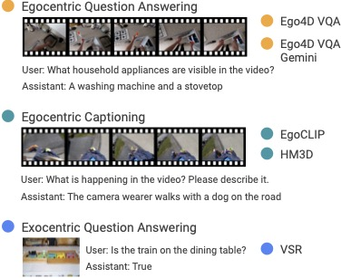

<h2 align="center"> <a href="https://arxiv.org/abs/2406.13807">Egocentric Video Understanding Dataset (EVUD)
</a></h2>
<h5 align="center"> If you like our project, please give us a star :star: on GitHub for the latest update.</h5>

<h5 align=center>

</h5>

## TL;DR
We introduce the Egocentric Video Understanding Dataset (EVUD), an instruction-tuning dataset for training VLMs on video captioning and question answering tasks specific to egocentric videos.

## News
- The AlanaVLM paper is now on Arxiv. Check it out: https://arxiv.org/abs/2406.13807
- Dataset and the code associated with our work will be released soon!